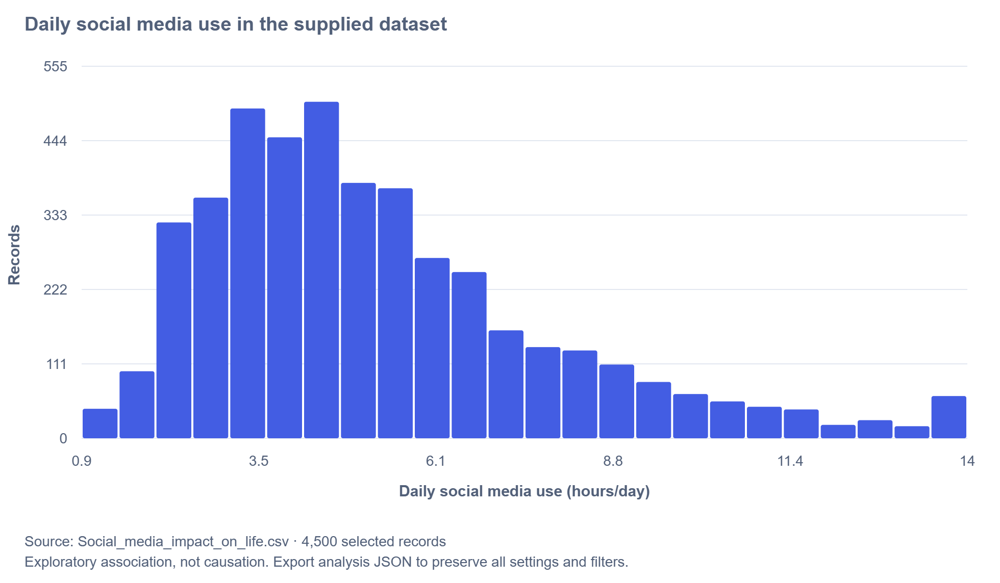
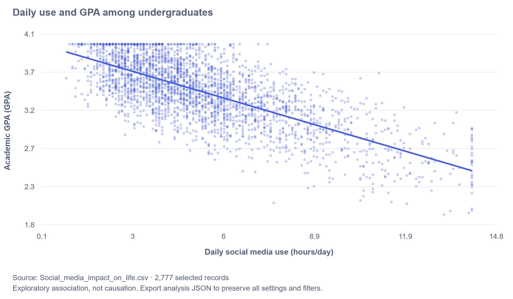
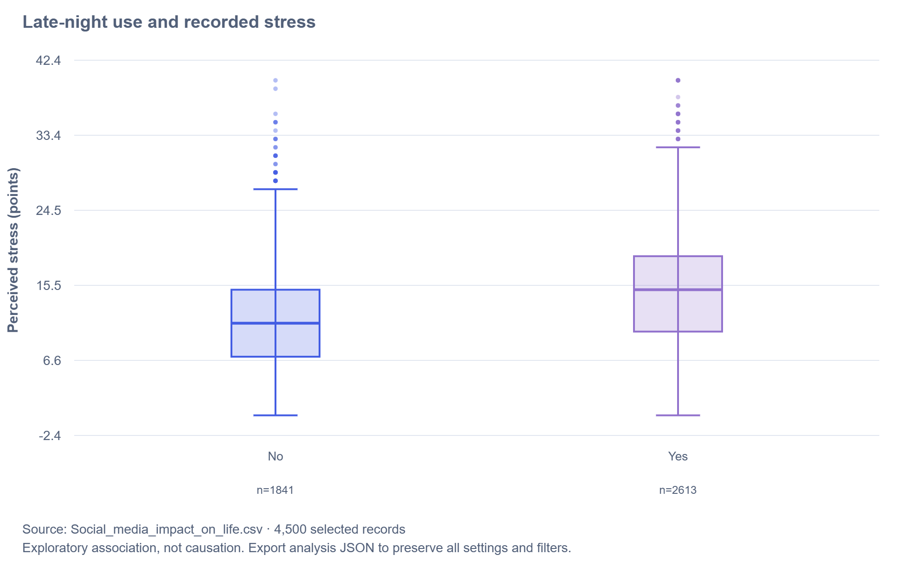

Student Wellbeing Explorer turns a 4,500-record dataset into an interactive way to investigate social media use, academic performance, sleep, and recorded stress. Readers can begin with an overall picture, select a student group, choose a suitable graph, and examine the numbers behind it.

Three examples develop the main story. Daily social media use has a right-tailed distribution: the mean is **5.30 hours per day**, compared with a median of **4.70 hours**. Among undergraduates, greater daily use is associated with lower recorded GPA, with **Pearson r = −0.720 across 2,721 complete pairs**. Across the supplied file, the group reporting late-night use has a median recorded stress score of **15**, compared with **11** for the other group.

These findings describe the supplied records. They support further questions about student habits and context; they do not establish that changing social media use would cause a particular academic or wellbeing outcome. The dashboard helps a reader examine that distinction by showing distributions, group sizes, missing values, and alternative views of the same data.

## 1 Business Problem

### 1.1 Background

A student-support team or university course audience needs a clear way to explore how social media habits appear alongside academic and wellbeing measures. A raw spreadsheet makes it difficult to see variation, compare groups, or explain why one average may give an incomplete picture.

The dashboard provides a shared exploratory tool for those discussions. Its purpose is to help readers ask better questions and communicate what the file shows. It has not been evaluated as an institutional decision system.

### 1.2 Business Question

How are daily social media use and late-night use associated with academic performance, sleep, and recorded stress, and how do the patterns change when comparable student groups are examined?

### 1.3 Business Importance

A pooled result can hide differences between academic levels, and a group average can hide substantial overlap between individuals. Treating a graph as proof of causation could also lead to unsupported claims about grades or wellbeing. A useful analysis must show the pattern, identify the records used, and explain its practical limits.

### 1.4 Analytical Objectives

1. Describe the distribution of daily social media use.
2. Examine its relationship with recorded GPA within an academic level.
3. Compare recorded stress distributions by late-night use.
4. Use filters, alternative charts, and summary tables to check the interpretation.
5. Communicate a reproducible finding with its source, selected group, and limitations.

## 2 Data Sources and References

### 2.1 Primary Dataset

The project uses the supplied `Social_media_impact_on_life.csv` file. The project owner identifies it with the Kaggle dataset below.

*Table 1. Data source information.*

| Item | Description |
|---|---|
| Dataset | [Impact of Social Media on Life](https://www.kaggle.com/datasets/harishyadav0506/impact-of-social-media-on-life) |
| Source platform | Kaggle |
| File used | `Social_media_impact_on_life.csv` |
| Observations | 4,500 records |
| Original variables | 16 |
| Date accessed | September 5, 2026 |

The access date records project use; it is not a collection date. Sampling methods, collection dates, real or synthetic status, measurement-scale validation, and redistribution terms have not been independently verified. Further provenance notes are in [data/SOURCE.md](data/SOURCE.md).

### 2.2 Software and Resources

The dashboard uses JavaScript for interaction and calculations, HTML and CSS for the interface, and SVG for charts. Node.js prepares the static website and runs the existing calculation checks. The professor's *Sample ASCI 2000 Final Project Report: Data Visualization of Diamond Prices* informed this report's organization: begin with a problem, document the data, explain each graph, and connect the findings to the question.

The figures below are PNG exports from this dashboard, using the supplied file. Their settings are documented beside each example. They are static illustrations; the dashboard is the place to change filters and explore alternatives.

## 3 Data Directory and Preparation

### 3.1 Variables Available in the Dashboard

*Table 2. Variable directory.*

| Variable | Type | Meaning and analytical use |
|---|---|---|
| `Student_ID` | Identifier | Record identifier; excluded from numerical analysis. |
| `Age` | Numerical | Recorded age in years; supports contextual comparisons. |
| `Gender` | Categorical | Recorded gender category; available as a filter or grouping variable. |
| `Academic_Level` | Categorical | High School, Undergraduate, or Postgraduate; used to compare more similar records. |
| `Primary_Platform` | Categorical | Primary social media platform; used for filtering and color groups. |
| `Daily_Usage_Hours` | Numerical | Recorded daily social media use in hours; the main explanatory variable in the examples. |
| `Weekend_Extra_Hours` | Numerical | Additional weekend use in hours, as described in the supplied plan. |
| `Device_Type` | Categorical | Primary device category. |
| `Sleep_Duration_Hours` | Numerical | Recorded nightly sleep duration in hours. |
| `Sleep_Quality_Score` | Ordinal | Recorded sleep-quality score; observed values are 1–5. |
| `Late_Night_Usage` | Categorical | TRUE/FALSE flag displayed as Yes/No; the supplied plan describes use past midnight. |
| `Social_Comparison_Frequency` | Categorical | Recorded frequency of social comparison. |
| `Perceived_Stress_Score` | Numerical | Recorded stress score; observed values are 0–40. |
| `Mental_Health_Index` | Numerical | Recorded index; its construction and clinical interpretation are unverified. |
| `Academic_Performance_GPA` | Numerical | Recorded GPA; a response variable in the examples. |
| `Overall_Impact` | Categorical | Beneficial, Neutral, or Negative label; classification rules are unknown. |

Definitions come from the column names, observed values, and supplied project plan. Original questionnaire wording and GPA comparability across academic levels remain unverified. The dashboard's **Methods & directory** view also shows observed ranges and missingness for the current selection.

### 3.2 Data Quality and Calculation Rules

*Table 3. Checks on the supplied file.*

| Check | Result |
|---|---:|
| Records | 4,500 |
| Variables | 16 |
| Missing GPA values | 85 |
| Missing stress values | 46 |
| Total missing cells | 131 |
| Duplicate full rows | 0 |
| Repeated nonmissing student IDs | 0 |

Missing numerical values are omitted only from the calculation that needs them. A usage/GPA chart therefore uses records with both values, while the usage histogram can use all 4,500 records. Zero remains a valid value. The dashboard does not fill in missing scores or automatically delete rows.

Means and medians describe the recorded values. Standard deviation uses the sample formula with n − 1. Pearson measures linear association; Spearman measures rank association and assigns average ranks to ties. Trend lines are ordinary least-squares fits. The examples retain the original units and use no logarithmic transformation.

## 4 How to Use the Dashboard

### 4.1 Start with an Overview

Open **Overview** to see the mean daily use, GPA, sleep duration, and stress score. Each card shows its valid sample size and a small distribution preview. Select the chart icon on a card to open that variable's distribution. The overview also introduces daily use versus GPA and the late-night-use comparison.

The academic-level, platform, gender, late-night-use, and daily-use-range filters define the records included in the analysis. A selected filter appears as a removable chip. Use **Reset filters** before reproducing an all-records example, and check the selected-record count whenever a result changes.

### 4.2 Choose the View That Fits the Question

*Table 4. Navigation guide.*

| View | Question it helps answer | Main controls or results |
|---|---|---|
| Overview | What does this selection look like overall? | Four means, valid sample sizes, distribution shortcuts, and guided questions. |
| Distributions | How is one variable distributed? | Histogram, cumulative distribution, or box plot for numerical variables; horizontal bar or donut for categories. |
| Relationships | How do two variables appear together? | X and Y variables, suitable chart choices, and a numerical or grouped summary. |
| Group comparison | Does a numerical relationship look different across groups? | **Color by** and, for scatter plots, **Separate panels** by academic level or gender. |
| Correlations | Which numerical variables move together? | Pearson or Spearman matrix, variable selection, and complete-pair counts. |
| Data explorer | Which records and missing values support the graphs? | Search, column sorting, pagination, quality counts, and CSV export. |
| Methods & directory | Where did the data come from, and how are results calculated? | Dataset reference, access date, limitations, and variable definitions. |

Chart choices change with the variable types. Two numerical variables offer a scatter plot, density grid, or binned averages. A category and a numerical variable offer box, strip, mean, or median plots. This helps readers select a display suited to the question.

### 4.3 Customize, Read, and Export a Chart

In **Chart settings**, choose the variables and chart type. Expand **Appearance** to change the palette, title, and the options relevant to that chart, such as histogram bins, point opacity, or trend lines. **Focus chart** expands the output for inspection. Hover over plotted marks for details, then read **Behind the chart** for sample sizes and numerical summaries.

Use **Export** to download a PNG or SVG chart, filtered CSV, analysis-summary text, or settings JSON. Export the chart and summary together so the image has a written record of the selection and statistics. Settings JSON documents the choices and dataset fingerprint; it is not an importable saved view.

**Open CSV** loads a compatible file into the current tab. Its values are processed locally in the browser. The importer requires this project's 16 named columns and accepts up to 50,000 records and a file smaller than 20 MB. A reload returns to the supplied sample. If an uploaded file is active, use **Restore supplied data** before reproducing this report.

## 5 Guided Analysis: Follow the Story in the Data

The examples progress from **how much use is recorded**, to **how use relates to GPA**, to **how another habit relates to stress**. All filters not explicitly specified below should remain **All**, and the daily-use range should be blank.

### 5.1 Begin with the Distribution of Daily Use

**Question:** Does the mean describe a typical record adequately?

To reproduce Figure 1:

1. Select **Distributions**, then **Reset filters**.
2. Set **Variable** to **Daily social media use** and **Chart type** to **Histogram**.
3. Set **Histogram bins** to **24** and leave **Display percentages** unchecked.
4. Set the custom title to **Daily social media use in the supplied dataset**. The figure uses the **Cobalt & violet** palette and light theme.

*Figure 1. Daily social media use across all 4,500 records; 24 equal-width bins.*

*Table 5. Daily-use summary, in hours per day.*

| Valid n | Minimum | Median | Mean | Standard deviation | Maximum |
|---:|---:|---:|---:|---:|---:|
| 4,500 | 0.90 | 4.70 | 5.30 | 2.60 | 14.00 |

The bars show how many records fall within each range of hours. The higher-use tail extends well beyond the central concentration and pulls the mean above the median. **2,380 records, or 52.9%, fall between 3 and 6 hours inclusive.** That exact percentage comes from counting records within the range, rather than estimating bar heights.

For a presentation, report both the mean and median. Saying “average daily use is 5.30 hours” alone leaves out the spread and the long tail. Changing the number of bins changes the visual detail, but it does not change those summary statistics.

### 5.2 Examine Daily Use and GPA Within Undergraduates

**Question:** Is greater daily use associated with lower recorded GPA within the largest academic-level group?

To reproduce Figure 2:

1. Select **Relationships** and **Reset filters**.
2. Set the **Academic level** filter to **Undergraduate**.
3. Set **X variable** to **Daily social media use**, **Y variable** to **Academic GPA**, and **Chart type** to **Scatter plot**.
4. Set **Summary correlation** to **Pearson** and enable **Show linear trend lines**.
5. Under **Appearance**, use **Point opacity = 0.30**, **Point size = 2.5**, and the **Cobalt & violet** palette. Set the title to **Daily use and GPA among undergraduates**.

*Figure 2. Undergraduate records with both daily-use and GPA values. The selected group contains 2,777 records; 2,721 complete pairs are plotted, and 56 records with missing GPA are excluded from this relationship.*

Each point represents one complete record. The cloud and fitted line slope downward: records with more daily use tend to have lower recorded GPA. The dashboard reports **Pearson r = −0.720**. The negative sign indicates the direction; it does not mean GPA falls by 0.720 points for each additional hour. A correlation is unitless, and the plotted line is a descriptive fit.

There is also considerable vertical variation. Records with similar daily use can have different GPAs. The graph therefore supports an association within this file, rather than a reliable prediction for an individual student or a causal claim about reducing use.

**Check the group context.** Repeat the same settings with each academic-level filter:

*Table 6. Daily-use/GPA Pearson correlations by academic level.*

| Selection | Selected records | Complete pairs | Pearson r |
|---|---:|---:|---:|
| All academic levels | 4,500 | 4,415 | −0.710 |
| High School | 1,477 | 1,450 | −0.703 |
| Undergraduate | 2,777 | 2,721 | −0.720 |
| Postgraduate | 246 | 244 | −0.633 |

The negative association appears within every listed academic level, so it is not solely an artifact of pooling those three groups. This check does not account for workload, course difficulty, prior attainment, or other unrecorded factors. The postgraduate group is much smaller; differences between these correlations have not been tested for statistical significance.

As an alternative, change **Chart type** to **Density grid** to inspect overlapping records, or change **Summary correlation** to **Spearman** to examine rank association. Neither option adds a causal interpretation. Spearman changes the summary statistic; the scatter plot's linear trend line remains an ordinary least-squares fit.

### 5.3 Compare Stress Distributions by Late-Night Use

**Question:** Do the two late-night-use groups differ in their recorded stress distributions?

To reproduce Figure 3:

1. Select **Relationships** and **Reset filters** so this comparison uses all academic levels.
2. Set **X variable** to **Late-night use** and **Y variable** to **Perceived stress**.
3. Choose **Box plot** and enable **Show outlier points**.
4. Use the **Cobalt & violet** palette and set the title to **Late-night use and recorded stress**.

*Figure 3. Recorded stress by late-night-use flag. The two boxes use 4,454 nonmissing stress values; 46 missing scores are excluded. No and Yes are the dashboard's labels for FALSE and TRUE.*

*Table 7. Stress summaries by late-night use.*

| Late-night use | Selected records | Valid stress n | Missing stress | Mean stress | Median stress |
|---|---:|---:|---:|---:|---:|
| No | 1,856 | 1,841 | 15 | 11.16 | 11 |
| Yes | 2,644 | 2,613 | 31 | 15.17 | 15 |

The line inside each box is the median; the box covers the middle 50% of values. Whiskers extend to observed values within 1.5 interquartile ranges, and separate points show values beyond them. These points remain in the calculations. The axis includes padding beyond the observed 0–40 range; the file does not contain negative stress scores.

The Yes group has a higher median and a mean approximately **4.00 points** higher, calculated before rounding the table values. The distributions overlap, and group sizes differ. A useful statement is: “In the supplied file, records marked for late-night use have higher central recorded stress scores.” The comparison does not establish that late-night use causes stress or that any score represents a clinical condition.

To investigate further, apply the **Undergraduate** filter and compare the boxes again. This changes the population being summarized. Keep the selected group and valid sample sizes in the explanation, rather than assuming the all-records result applies unchanged.

### 5.4 Extend the Question to Sleep and Platforms

For sleep, select **Relationships**, use **Reset filters**, and choose **Daily social media use** as X and **Sleep duration** as Y. Set **Summary correlation** to **Pearson**. Across all 4,500 complete pairs, the correlation is **−0.716**: greater recorded use tends to appear alongside shorter recorded sleep. A **Density grid** helps reveal concentrations of overlapping records. The overall mean sleep duration is **6.70 hours**, which describes this file rather than a recommended sleep target.

For platforms, open **Group comparison**, reset the filters, and set X to **Daily social media use**, Y to **Academic GPA**, and the chart to **Scatter plot**. Choose **Primary platform** under **Color by** and **Academic level** under **Separate panels**. The panels share axis ranges and color mapping. This helps inspect platform patterns within academic levels, but unequal or small groups limit comparisons; the display does not establish that one platform causes better or worse outcomes.

## 6 How the Coding Supports the Analysis

The dashboard replaces repeated manual graph creation with a common calculation and display workflow. When a filter changes, the same selected records feed the graph and its supporting statistics. The reader can inspect a pattern, revise the question, and export the result without writing code.

*Table 8. Implementation choices and their value to the reader.*

| Component | How it helps |
|---|---|
| `src/stats.js` | Provides shared filtering, CSV parsing, summaries, correlations, and data-quality calculations. The same statistical functions are used in the browser and the existing tests. |
| `src/charts.js` | Draws SVG charts with labels and mark details. Variable-type rules make appropriate graph choices available. |
| `src/app.js` | Connects navigation, filters, chart settings, summary tables, CSV loading, and exports. This keeps the exploratory steps available through the interface. |
| `src/source.js` | Stores the dataset reference and access date consistently across the reference view and exports. |
| `scripts/build.cjs` | Creates a portable static website and records the CSV fingerprint, helping identify which file an exported analysis used. |

For example, the missing-data rule prevents the 85 blank GPA values from becoming artificial zero GPAs. The undergraduate filter then selects 2,777 records, and the pairwise calculation uses only their 2,721 complete usage/GPA pairs. The chart, caption, and summary make those distinctions visible.

Chart calculations use all eligible records. Very large scatter and strip displays may reduce the number of rendered points, as explained in the dashboard captions; this does not reduce the data used for the statistics. The supplied examples are below those display thresholds.

The project uses plain JavaScript and the Node standard library, with no application dependencies to install. Its static design supports GitHub Pages deployment and browser-local CSV analysis. The existing 12 calculation/parser/chart tests passed during project validation; details and the limits of the checks are recorded in [docs/VALIDATION.md](docs/VALIDATION.md).

## 7 Discussion and Practical Use

The three graphs answer different parts of the business question. The histogram establishes that a mean alone is incomplete. The undergraduate scatter plot shows a negative association while making individual variation visible. The stress box plots show a group difference alongside overlap and unequal sample sizes.

For a student-support presentation or coursework discussion:

1. **Name the selection.** State the academic level, other filters, and valid sample size alongside a finding.
2. **Show variation.** Pair an average with a histogram, scatter plot, or box plot rather than reporting a single number alone.
3. **Check related groups.** Repeat a pooled analysis within academic levels before interpreting differences between platforms or habits.
4. **Preserve the analysis.** Export the chart and analysis-summary text, and retain the settings JSON when a detailed record is useful.
5. **Use the findings to frame further questions.** Stronger policy or intervention claims would require verified data provenance and an appropriate research design.

The dashboard's contribution is an inspectable exploration process. It helps readers see how an answer depends on the variable, selected group, chart, and missing-data rule.

## 8 Limitations

The source link and project access date are recorded, but representativeness and the collection or generation process remain unverified. The file should not be described as a representative university survey or as confirmed real-world observations without additional source evidence.

This analysis is descriptive. There is no longitudinal follow-up, randomized intervention, adjustment for confounding, hypothesis testing, or confidence interval analysis in these examples. Relationships and group differences therefore do not establish causation or statistical significance. Measurement definitions, stress-scale validation, and GPA comparability also limit interpretation.

The importer is designed for this project's schema, not arbitrary datasets. Analysis settings and uploaded data stay in the current tab; only the theme preference persists on the device. Publishing the supplied static build makes its bundled sample accessible to people who can access the site. Dataset redistribution terms must be checked separately; this repository grants no third-party dataset rights.

## 9 Conclusion

The supplied file shows a right-tailed distribution of daily social media use, a negative usage/GPA association within undergraduates, and higher central stress scores among records marked for late-night use. These findings become more useful when the reader can reproduce the selection, examine the spread, and understand the sample sizes.

Student Wellbeing Explorer supports that process through filters, suitable graph options, supporting tables, and exports. Its role is to turn a data file into an understandable, reproducible discussion of patterns and their limits.

## 10 References

harishyadav0506. (n.d.). *Impact of Social Media on Life* [Data set]. Kaggle. Retrieved September 5, 2026, from [the dataset page](https://www.kaggle.com/datasets/harishyadav0506/impact-of-social-media-on-life).

Pei Pei. (2026, August 17). *Sample ASCI 2000 Final Project Report: Data Visualization of Diamond Prices*. Course reference supplied by the project owner. Used as a report-structure example; the diamonds data are not used in this dashboard.

